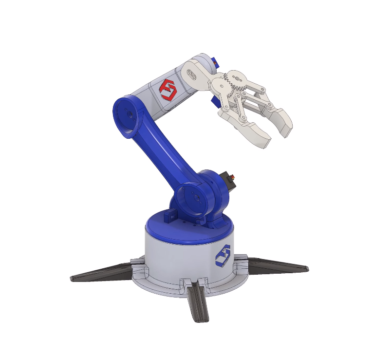

# Brazo Robotico de 3 grados de libertad usando Micro-Ros y ESP32

```Integrantes```

    Bastian Almonacid
    Darwin Muñoz
## Robot de 3 grados de libertad

El robot a implementar es el siguiente, el cual posee 6 grados de libertad, además 
de una pinza o gripper, el cual es el encargado de poder tomar los objetos. 
Si bien el brazo posee 6 grados de libertad, la implementacion se hará de solo 3 grados,
esto se debe en gran medida a los alcances y fechas del proyecto.

Este brazo fue impreso en 3D con filamento PLA+, las imágenes del robot 
se muestran a continuación.

//Agregar fotos de la maquina//

## Implementacion del brazo 

Si bien en un principio lo ideal era poder modelar el brazo robotico, nos vimos alcanzandos con los tiempos de entrega de dicho proyecto, por lo que tomamos la decisión de tomar un modelo ya creado. 
El modelo que se verá a continuación pertenece a `Fabri_creator`, el cual fue tomado para este proyecto y posteriormente impreso para su implementacion con micro-ros.



## Creación de nodos y paquetes en Micro-ros

Como se muestra a continuación 
